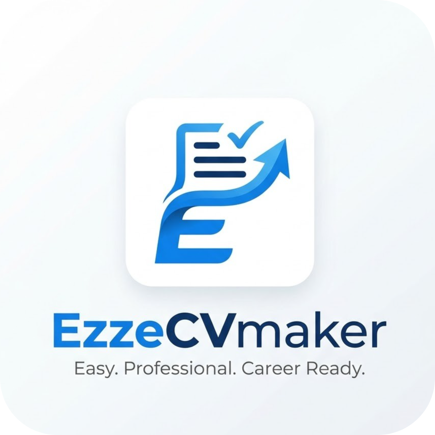

<h1>
  
  EzzeCV — Build Your Career Story
</h1>


**EzzeCV** is a premium, fully offline CV & resume builder built with Flutter.  
Create professional, ATS-friendly resumes directly on your device — no internet, no cloud, complete privacy.
---

<h1>
  
</h1>

---

## ✨ Key Features

- 🔒 **100% Offline & Private** — No backend, no data collection
- 🎨 **5 Premium Templates** — ATS, Corporate, Academic, Tech, Managerial
- 🖌️ **Live Customization** — Colors & fonts with real-time preview
- 🖼️ **Profile Image Cropper** — Perfect 1:1 avatar support
- 💾 **Local Draft Saving** — Stored directly on device
- 🔄 **JSON Backup** — Export & restore data easily
- 🌓 **Dark / Light Mode**
- 🌐 **Bilingual UI** — English & Bengali

---

## 🛠️ Tech Stack

- **Flutter (Dart)**
- **Provider** (State Management)
- **PDF & Printing**
- **Local File Storage**
- **Image Picker & Cropper**

---

## 🚀 Getting Started

```bash
git clone https://github.com/yourusername/ezzecv.git
cd ezzecv
flutter pub get
flutter run
```

---

## 📂 Project Structure

```
lib/
├── core.dart
├── models.dart
├── cv_provider.dart
├── pdf_generator.dart
├── screens/
└── main.dart
```

---

## 🤝 Contributing

Contributions and ideas are welcome.  
You can extend templates via `pdf_generator.dart`.

---


**Developed by Ezze Softwares**